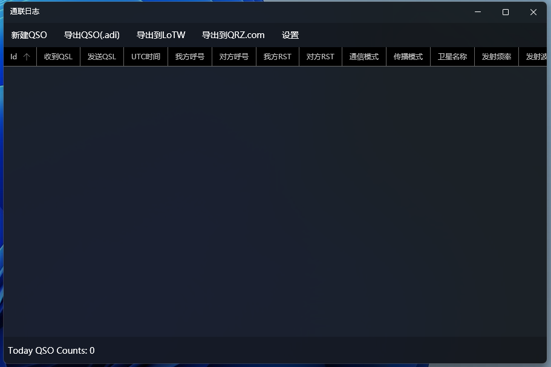
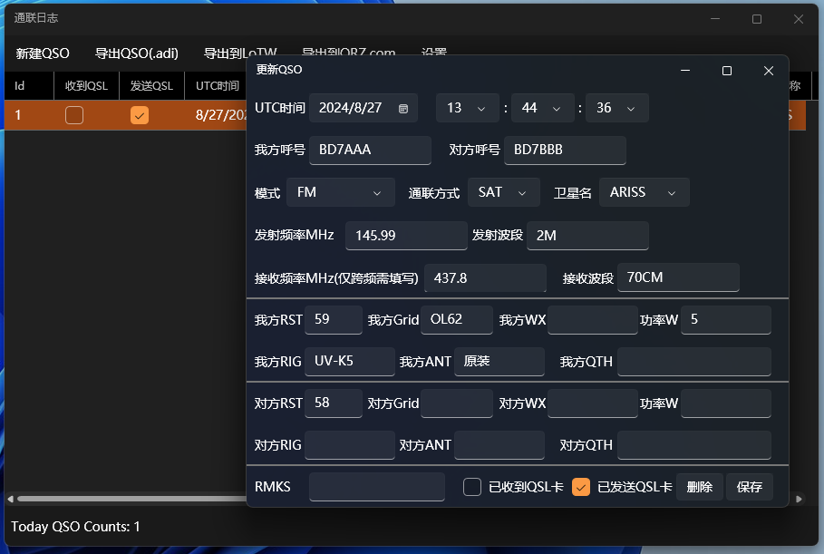

## eLogbook of WPF
> 一个简单基础的电子通联日志

该项目旨在让用户可以简单快速的记录QSO并且便于导出/同步到LoTW和QRZ.com等平台.

### 功能
- 添加/编辑/删除 QSO
- 自动填充字段
- 导出adi
- *同步到LoTW和QRZ.com* (写出来了但是未验证可用~~因为我也还没有呼号只能靠别人测试~~)

### 问题反馈
对于诸如卫星数据更新和程序问题的都可以提出issue,由于本人学业繁忙可能无法及时回复致歉

### 贡献
由于只是一个很小的项目,且本身我自己写的也不好,所以贡献也没有什么很高要求

但是不要直接合并到main里面谢谢(

### 关于项目
只是我在初学C#过程中的一个小练手项目而已,项目仍然有许多不足

(可以说就是屎山)

项目使用了[FluentWPF](https://github.com/sourcechord/FluentWPF)作为外观框架

同时,对于同步LoTW和QRZ.com的代码,则参考了[Gitee:X-QSL](https://gitee.com/yuzhenwu/x-qsl-amateur-radio-adif-tool)一位国人写的小工具

十分感谢并送上诚挚的73!

